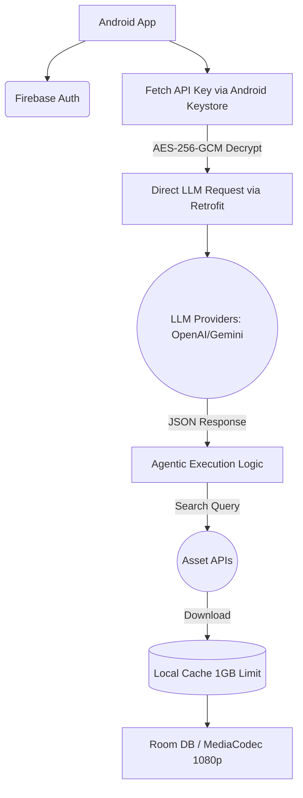
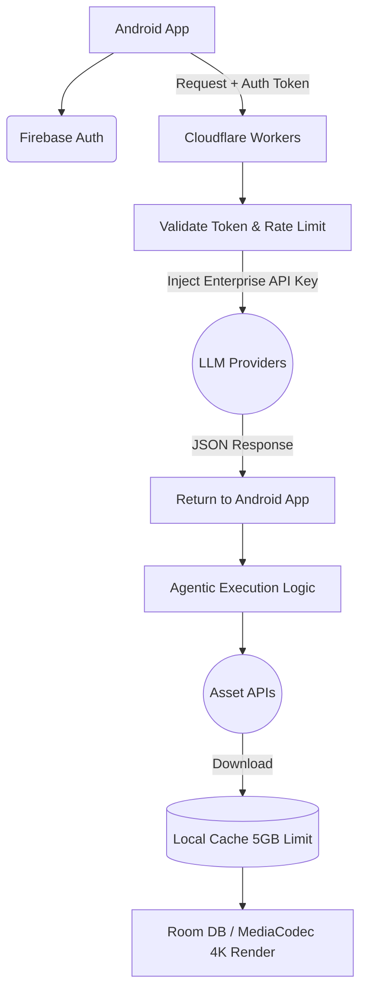

# System Architecture Document: Magistory

**Document Status:** V2.1 (Enhanced for Vibe Coding)
**Platform:** Android (Native)
**Architecture Pattern:** Client-Heavy / Offline-First with Hybrid Cloud Routing

---

## 1. Core Technology Stack (Global/Shared)
[app](app)
| Category | Technologies |
|----------|-------------|
| **Language** | Kotlin (Coroutines/Flow) |
| **UI** | Jetpack Compose (Material3) |
| **Video Playback** | ExoPlayer (Media3) |
| **Video Processing** | MediaCodec API, FFmpeg (via NDK) |
| **Local Database** | Room DB (SQLite) with Write-Ahead Logging (WAL) |
| **Background Work** | WorkManager |
| **Identity** | Firebase Authentication |
| **Telemetry** | Firebase Crashlytics |
| **Networking** | Retrofit + OkHttp + Moshi |
| **DI** | Hilt (Dagger) |
| **Image Loading** | Coil |
| **Navigation** | Compose Navigation |
| **Third-Party Asset APIs** | Pexels, Pixabay, Freesound |

### Build Configuration

- **Min SDK:** 28 (Android 9.0)
- **Target SDK:** 37
- **Kotlin:** Latest stable
- **Compose BOM:** Latest stable

---

## 2. Package Structure

```
com.example.magistory140/
├── data/
│   ├── local/
│   │   ├── dao/              ← Room DAOs (ProjectDao, TrackDao, ClipDao)
│   │   ├── entity/           ← Room Entities (ProjectEntity, TrackEntity, ClipEntity)
│   │   └── database/         ← MagistoryDatabase.kt
│   ├── remote/
│   │   ├── api/              ← Retrofit interfaces (LlmApi, AssetApi)
│   │   ├── dto/              ← Data Transfer Objects (LlmResponseDto, AssetDto)
│   │   └── interceptor/      ← OkHttp interceptors (AuthInterceptor, ApiKeyInterceptor)
│   └── repository/           ← Repository implementations (ProjectRepositoryImpl, etc.)
├── domain/
│   ├── model/                ← Domain models (Project, TimelineTrack, TimelineClip)
│   ├── repository/           ← Repository interfaces (ProjectRepository, LlmRepository)
│   └── usecase/              ← Use cases (GenerateTimelineUseCase, ExportVideoUseCase)
├── ui/
│   ├── screen/
│   │   ├── splash/           ← SplashScreen.kt
│   │   ├── onboarding/       ← OnboardingScreen.kt, OnboardingViewModel.kt
│   │   ├── login/            ← LoginScreen.kt, LoginViewModel.kt
│   │   ├── home/             ← HomeScreen.kt, HomeViewModel.kt
│   │   ├── newproject/       ← NewProjectScreen.kt, NewProjectViewModel.kt
│   │   ├── aiprocessing/     ← AIProcessingScreen.kt, AIProcessingViewModel.kt
│   │   ├── editor/           ← TimelineEditorScreen.kt, EditorViewModel.kt
│   │   ├── export/           ← ExportScreen.kt, ExportViewModel.kt
│   │   ├── settings/         ← SettingsScreen.kt, SettingsViewModel.kt
│   │   └── subscription/     ← SubscriptionScreen.kt [Premium]
│   ├── component/            ← Reusable composables (TimelineTrackView, ClipThumbnail, etc.)
│   ├── navigation/           ← NavGraph.kt, Routes.kt
│   └── theme/                ← Theme.kt, Color.kt, Type.kt
├── di/                       ← Hilt modules (NetworkModule, DatabaseModule, RepositoryModule)
├── security/                 ← ApiKeyManager.kt, EncryptionHelper.kt
├── worker/                   ← CachePurgeWorker.kt, ExportWorker.kt
└── util/                     ← Extensions.kt, Constants.kt
```

---

## 3. Dependency Injection (Hilt)

### Module Breakdown

| Module | Scope | Provides |
|--------|-------|----------|
| `NetworkModule` | Singleton | Retrofit, OkHttp, Moshi, API interfaces |
| `DatabaseModule` | Singleton | Room DB instance, DAOs |
| `RepositoryModule` | Singleton | Bind repository interfaces → implementations |
| `SecurityModule` | Singleton | ApiKeyManager, EncryptionHelper |

### Contoh Pattern

```kotlin
@Module
@InstallIn(SingletonComponent::class)
object DatabaseModule {
    @Provides
    @Singleton
    fun provideDatabase(@ApplicationContext context: Context): MagistoryDatabase {
        return Room.databaseBuilder(
            context,
            MagistoryDatabase::class.java,
            "magistory_db"
        ).build()
    }

    @Provides
    fun provideProjectDao(db: MagistoryDatabase): ProjectDao = db.projectDao()
}
```

---

## 4. State Management

### Pattern: Unidirectional Data Flow (UDF)

```
User Action → ViewModel (process) → StateFlow<UiState> → Composable (render)
```

### Rules

- **ViewModel** mengekspos `StateFlow<ScreenUiState>` ke Composable.
- **UiState** adalah `data class` per screen (immutable).
- **Events** dari UI dikirim ke ViewModel via function calls.
- **Side effects** (navigasi, snackbar, dll) dihandle via `Channel<UiEvent>` → `receiveAsFlow()`.

### Contoh Pattern

```kotlin
// UiState
data class HomeUiState(
    val projects: List<Project> = emptyList(),
    val isLoading: Boolean = true,
    val error: String? = null
)

// Side Effects
sealed class HomeUiEvent {
    data class NavigateToEditor(val projectId: Long) : HomeUiEvent()
    data class ShowError(val message: String) : HomeUiEvent()
}

// ViewModel
@HiltViewModel
class HomeViewModel @Inject constructor(
    private val getProjectsUseCase: GetProjectsUseCase
) : ViewModel() {

    private val _uiState = MutableStateFlow(HomeUiState())
    val uiState: StateFlow<HomeUiState> = _uiState.asStateFlow()

    private val _events = Channel<HomeUiEvent>()
    val events = _events.receiveAsFlow()

    init { loadProjects() }

    fun onProjectClick(projectId: Long) {
        viewModelScope.launch {
            _events.send(HomeUiEvent.NavigateToEditor(projectId))
        }
    }

    private fun loadProjects() {
        viewModelScope.launch {
            _uiState.update { it.copy(isLoading = true) }
            getProjectsUseCase()
                .onSuccess { projects ->
                    _uiState.update { it.copy(projects = projects, isLoading = false) }
                }
                .onFailure { error ->
                    _uiState.update { it.copy(error = error.message, isLoading = false) }
                }
        }
    }
}
```

---

## 5. BAGIAN 1: ARSITEKTUR PENGGUNA GRATIS (FREE TIER)

Arsitektur untuk pengguna gratis difokuskan pada desentralisasi, di mana perangkat lokal (Local Security) dan eksekusi jaringan terjadi secara langsung (peer-to-peer) dari perangkat ke penyedia layanan AI.

### 5.1 Data Flow (Direct Routing)



### 5.2 Security Architecture (BYOK Implementation)

Sistem ini menjamin kedaulatan data dan memastikan Magistory (server) tidak memiliki akses ke API Key pribadi pengguna.

- **Encryption Setup:** Aplikasi membuat symmetric key menggunakan Android Keystore System (hardware-backed). API key pengguna yang diinputkan akan dienkripsi dengan AES-256-GCM beserta Initialization Vector (IV).
- **Storage:** Byte array terenkripsi disimpan di EncryptedSharedPreferences. Raw text API key langsung dihapus dari memori aplikasi.
- **Just-in-Time Decryption:** Saat request AI dibuat, key didekripsi di memori sementara (RAM) hanya untuk disematkan ke HTTP Header Retrofit. Setelah request dikirim, memori akan segera dibersihkan oleh Garbage Collector.

### 5.3 Local Processing & Rendering

- **Agentic Execution:** Perangkat Android bertindak penuh sebagai "Agen". Setelah menerima respon JSON instruksi dari LLM, Android yang akan melakukan request konkuren (async) ke API penyedia aset.
- **Rendering Pipeline:** Terbatas pada resolusi standar (hingga 1080p). Menggunakan MediaCodec API untuk hardware decoding/encoding.

---

## 6. BAGIAN 2: ARSITEKTUR PENGGUNA BERBAYAR (PREMIUM TIER)

Arsitektur premium berfokus pada kecepatan menggunakan infrastruktur Edge Computing untuk melindungi Enterprise API Key, mengatur Rate Limiting, dan membuka limitasi performa perangkat.

### 6.1 Data Flow (Edge Cloud Routing)



### 6.2 Premium Cloud Infrastructure (Cloudflare Workers)

- **Serverless API Gateway:** Menggunakan Cloudflare Workers untuk Edge routing. Ini memberikan latensi yang sangat rendah tanpa perlu memelihara server backend monolitik.
- **Validation & Security:** Worker bertugas menerima Firebase Auth ID Token dari aplikasi Android dan memvalidasi keabsahan status langganan (Premium) pengguna tersebut.
- **Token Bucket Algorithm:** Worker menerapkan rate-limiting ketat berbasis User ID. Hal ini mencegah penyalahgunaan kuota (abuse) Enterprise LLM Magistory.
- **Key Injection:** Worker bertugas merutekan ulang request, menyuntikkan API Key rahasia milik Magistory ke dalam header secara aman di sisi cloud, sebelum diteruskan ke OpenAI/Anthropic/Google.

### 6.3 Advanced Rendering & State Management

- **4K Offline-First Rendering:** File JSON state dari Room DB diterjemahkan oleh ExoPlayer untuk preview. Saat proses ekspor, alokasi memori maksimal diberikan ke MediaCodec API untuk memproses resolusi 4K (Ultra HD) 60FPS.
- **Fallback Mechanism:** Jika ada codec asset 4K yang tidak didukung secara native oleh chip perangkat, sistem memiliki fallback otomatis menggunakan FFmpeg (dikompilasi via NDK C++).

---

## 7. AI Response Contract

LLM diinstruksikan untuk menghasilkan JSON timeline dengan format berikut. Format ini digunakan oleh Agentic Execution Logic untuk membangun timeline secara otomatis.

### Request (System Prompt → LLM)

```
Kamu adalah asisten video editor. Berdasarkan instruksi pengguna,
hasilkan JSON timeline yang berisi daftar tracks (VIDEO, AUDIO, TEXT)
beserta clips yang sesuai. Gunakan source dari: pexels, pixabay, freesound.
```

### Response Format

```json
{
  "title": "Morning Routine Vlog",
  "description": "Video tentang morning routine yang aesthetic",
  "tracks": [
    {
      "type": "VIDEO",
      "orderIndex": 0,
      "clips": [
        {
          "searchQuery": "sunrise cityscape drone",
          "source": "pexels",
          "durationMs": 5000,
          "transition": "crossfade"
        },
        {
          "searchQuery": "coffee brewing close up",
          "source": "pixabay",
          "durationMs": 3000,
          "transition": "cut"
        }
      ]
    },
    {
      "type": "AUDIO",
      "orderIndex": 1,
      "clips": [
        {
          "searchQuery": "calm lo-fi ambient music",
          "source": "freesound",
          "durationMs": 30000,
          "volume": 0.7
        }
      ]
    },
    {
      "type": "TEXT",
      "orderIndex": 2,
      "clips": [
        {
          "label": "My Morning Routine ☀️",
          "startTimeMs": 0,
          "durationMs": 3000,
          "style": "title"
        }
      ]
    }
  ]
}
```

### Parsing Pipeline

```
LLM JSON Response
    → Moshi deserialize → LlmTimelineDto
    → Mapper → Domain Model (TimelineTrack, TimelineClip)
    → Asset Resolver (concurrent Pexels/Pixabay/Freesound API calls)
    → Download to local cache
    → Save to Room DB
    → Render preview via ExoPlayer
```
